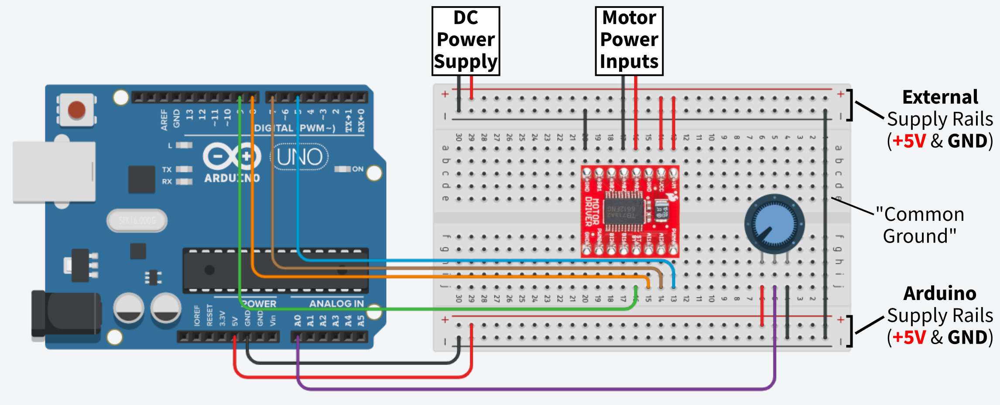

## Exercise 3: Controlling a DC Motor with an H-Bridge

### Components

* DC Motor: [DFRobot Accessories Micro DC Motor with Encoder-SJ01](https://www.mouser.co.uk/ProductDetail/DFRobot/FIT0450)
* Motor Driver: [SparkFun TB6612FNG Dual Motor Driver](https://www.mouser.co.uk/ProductDetail/SparkFun/ROB-14450?qs=wd5RIQLrsJhQdlH%2FW5H2aQ%3D%3D)
* [10k Trim Potentiometer](https://www.rapidonline.com/catalogue/product?id=68-0242)

### Summary

Controlling the speed of a DC Motor via a potentiometer input. Speed can be controlled in both the clockwise and counter-clockwise directions, with the potentiometer at its center point, speed demand will be 0 (`PWMA = 0`).

### Circuit Schematic

