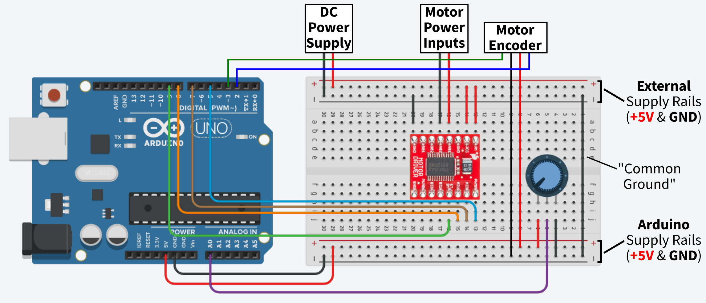

## Exercise 5 (Advanced): Determining direction of rotation

### The Code

[ex5-motor-and-encoder-direction.ino](./ex5-motor-and-encoder-direction.ino)

### Components

* DC Motor: [DFRobot Accessories Micro DC Motor with Encoder-SJ01](https://www.mouser.co.uk/ProductDetail/DFRobot/FIT0450)
* Motor Driver: [SparkFun TB6612FNG Dual Motor Driver](https://www.mouser.co.uk/ProductDetail/SparkFun/ROB-14450?qs=wd5RIQLrsJhQdlH%2FW5H2aQ%3D%3D)
* [10k Trim Potentiometer](https://www.rapidonline.com/catalogue/product?id=68-0242)

### Summary

Controlling the speed of a DC Motor via a potentiometer input. Speed can be controlled in both the clockwise and counter-clockwise directions, with the potentiometer at its center point, speed demand will be 0 (`PWMA = 0`). ([Exercise 3](../ex3-h-bridge-motor-control/README.md))

Reading motor encoder signals and calculating the rotational speed of the motor.

**Building on [Exercise 4](../ex4-motor-and-encoder/README.md)**: Utilising the second encoder channel on the motor to *additionally* determine the direction of rotation as well as the speed.

### Circuit Schematic

